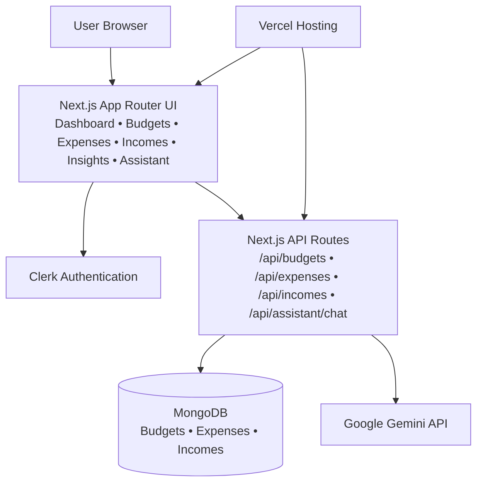

# FinTracker

A personal finance management application built with **Next.js** that helps users track expenses, manage budgets, and receive AI-driven financial insights.

## 🔗 Live Demo

[fin-tracker-blond.vercel.app](https://fin-tracker-blond.vercel.app)

## ✨ Features

- 📊 **Financial Dashboard** — Visualize spending with charts and dashboards (Recharts)
- 🤖 **AI Insights** — Powered by Google Gemini for smart financial advice and expense categorization
- 🔐 **Authentication** — Secure sign-in via Clerk
- 🗄️ **Data Persistence** — MongoDB (Mongoose) for storing transactions and budget data
- 🎨 **Modern UI** — Built with Tailwind CSS, Shadcn/UI (Radix UI), and Framer Motion animations

## 🛠️ Tech Stack

| Layer | Technology |
|-------|------------|
| Frontend | Next.js 14, React 18, Tailwind CSS |
| UI Components | Shadcn/UI, Radix UI, Framer Motion |
| AI | Google Gemini (`@google/generative-ai`) |
| Auth | Clerk |
| Database | MongoDB, Mongoose |
| Charts | Recharts |
| Deployment | Vercel |

## 🧩 Architecture Diagram



## 🚀 Getting Started

```bash
# Clone the repository
git clone https://github.com/SarthakPaandey/FinTracker.git
cd FinTracker

# Install dependencies
npm install

# Set up environment variables
cp .env.example .env.local
# Fill in CLERK_SECRET_KEY, MONGODB_URI, GOOGLE_AI_API_KEY, etc.

# Run development server
npm run dev
```

Open [http://localhost:3000](http://localhost:3000) in your browser.

## 📄 License

MIT
